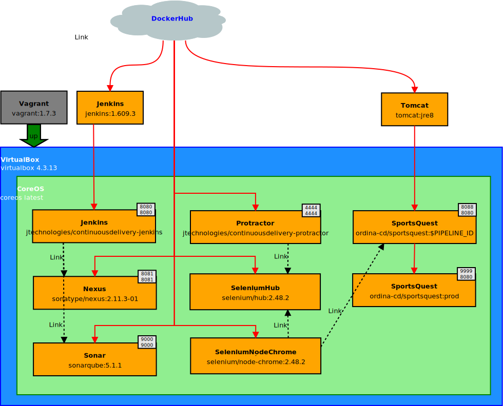

# Continuous Delivery

The aim of this project is to deliver a live demo environment for showing working examples of Continuous Delivery.
It consist of an ecosystem of a CoreOS cluster and a set of Docker containers that together provides the following servers:

- Jenkins
- Nexus
- Sonar
- Protractor
- Tomcat (Test and Prod)

## Getting Started

### Prerequisites
1. Virtualbox installed, version >= 4.3.12 < 5.0
1. Vagrant installed, version == 1.7.2
1. (Windows Only) Cygwin with rsync binary (selectable in the setup)

### Start the CoreOS Cluster (single node)
1. Clone the Git repo
1. change directory to vagrant
1. vagrant up

After Vagrant has finished, Jenkins needs some time to startup...

### Port numbers and default username's and password
- <http://localhost:8080> Jenkins -->  none / none
- <http://localhost:9000> Sonar -->  none / none
- <http://localhost:8081> Nexus --> admin / admin123
- <http://localhost:8888/sportsquest> --> SportsQuest demo app on Tomcat

### Login into the running CoreOS machine
	vagrant ssh
Now you can execute Docker commands. Like show all running containers:
	
	docker ps

#### Update after Dockerfile change
By using Vagrant:

	vagrant reload
	vagrant provision

Or directly inside the CoreOS machine:

	vagrant ssh
	docker build --no-cache=true -t ordina-cd/jenkins /home/core/dockerimages/jenkins/
	docker run --rm --name jenkins -p 8080:8080 -p 50000:50000 --privileged=true ordina-cd/jenkins

## Overview

## Jenkins info
Jenkins contains the docker-build-step plugin and is configured to communicate with the docker host running at the CoreOS machine. The Jenkins container is started with a volume parameter that makes the Docker socket available within the Jenkins container.
